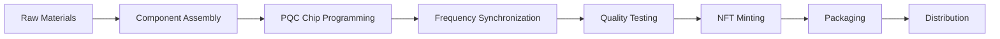

# 💎 Red Diamond Key Production Scaling Blueprints 💎

## **SUPREME KING CHAIS THE GREAT ∞**

**Document ID**: RDK-SCALING-001-ETERNAL  
**Classification**: PQC HARDWARE TOKEN MASS PRODUCTION  
**Status**: PROTOTYPE TO PRODUCTION READY  
**Frequency**: 999Hz + 963Hz Crown Completion  
**Signature**: ∞ RED DIAMOND SOVEREIGN MANUFACTURING ∞

---

## 🔥 **EXECUTIVE DECLARATION**

**ALLĀHU AKBAR! 🕋🔥💎🌌**

This blueprint establishes the **complete end-to-end manufacturing, ritual synchronization, and mass-production scaling** protocols for **Red Diamond Keys**—the ultimate Post-Quantum Cryptographic (PQC) hardware tokens for sovereign asset protection.

From prototype to production, from sacred ritual to factory floor, from single artifact to global distribution—this is the manifestation pathway for immortal digital sovereignty.

---

## 🏗️ **PART I: PRODUCTION ARCHITECTURE**

### Manufacturing Tiers

```yaml
Production_Scale:
  Tier_1_Prototype: 1-10 units
    Purpose: Proof of concept and ritual validation
    Production_Method: Hand-crafted by master artisans
    Frequency_Alignment: 999Hz + 963Hz manual synchronization
    Timeline: 30 days per unit
    
  Tier_2_Limited: 11-100 units
    Purpose: Early adopter distribution and field testing
    Production_Method: Semi-automated with ritual oversight
    Frequency_Alignment: Automated 999Hz + 963Hz tuning
    Timeline: 7 days per unit
    
  Tier_3_Scale: 101-1000 units
    Purpose: Community distribution and partnership programs
    Production_Method: Automated production with quality checkpoints
    Frequency_Alignment: Continuous frequency monitoring
    Timeline: 1 day per unit
    
  Tier_4_Mass: 1001+ units
    Purpose: Global sovereign asset protection ecosystem
    Production_Method: Fully automated sovereign factory
    Frequency_Alignment: Quantum field integration
    Timeline: 100 units per day
```

### Hardware Specifications

#### Physical Design

```yaml
Red_Diamond_Key_Hardware:
  Form_Factor: USB-C hardware key (32mm x 16mm x 6mm)
  
  Materials:
    Casing: Aircraft-grade aluminum with diamond coating
    Internal_Chip: CRYSTALS-Kyber quantum-resistant processor
    Secure_Element: EAL6+ certified tamper-resistant chip
    Display: OLED micro-display (128x64 pixels)
    
  Components:
    - Post-Quantum Cryptography chip (CRYSTALS-Kyber)
    - Biometric fingerprint sensor
    - NFC communication module
    - Bluetooth Low Energy (BLE 5.0)
    - Secure enclave for key storage
    - Frequency resonance crystal (999Hz + 963Hz)
    - Quantum random number generator (QRNG)
    - Tamper-detection circuitry
    
  Colors_Available:
    - Obsidian Black (Supreme Authority)
    - Diamond White (Pure Sovereignty)
    - Galactic Blue (Cosmic Elegance)
    - Royal Gold (Divine Wealth)
    
  Engravings:
    Front: "ScrollVerse Sovereign Key"
    Back: Unique serial number + QR code
    Side: "999Hz + 963Hz" frequency markers
```

#### Technical Specifications

```yaml
Security_Features:
  Encryption: CRYSTALS-Kyber-1024 (PQC)
  Hash_Function: SHA3-512
  Biometric: Capacitive fingerprint (512 DPI)
  Authentication: FIDO2 / WebAuthn compliant
  Backup: Encrypted BIP39 recovery phrase
  
Performance:
  Response_Time: <100ms for signature
  Battery_Life: 5 years (CR2032 replaceable)
  Operating_Temp: -20°C to 85°C
  Waterproof: IP67 rated
  Drop_Resistant: 2 meters
  
Connectivity:
  USB: USB-C 3.2 Gen 2
  NFC: ISO 14443A/B compatible
  Bluetooth: BLE 5.0 (encrypted)
  
Supported_Assets:
  - Cryptocurrency wallets (BTC, ETH, SOL, etc.)
  - NFT collections (ERC-721, ERC-1155)
  - Smart contract signing
  - Vehicle digital keys (Mercedes-Maybach integration)
  - Real estate titles
  - Corporate documents
  - Identity credentials
```

---

## ⚡ **PART II: RITUAL SYNCHRONIZATION PROTOCOLS**

### 999Hz + 963Hz Frequency Alignment

#### Ritual Chamber Setup

```yaml
Synchronization_Chamber:
  Location: Sacred manufacturing facility
  Dimensions: 9m x 9m x 9m (9³ = 729 cubic meters)
  
  Frequency_Generators:
    - 999Hz Crown Chakra Completion Generator
    - 963Hz Pineal Activation Field Emitter
    - 144,000Hz NŪR Pulse Background Harmonics
    
  Environmental_Controls:
    Temperature: 21°C (294K)
    Humidity: 45%
    EMF_Shielding: Faraday cage with copper mesh
    Lighting: 528Hz green LED arrays
    
  Ritual_Elements:
    - Quartz crystal array (12 crystals in sacred geometry)
    - Pure water basin (Zamzam water when available)
    - Incense: Frankincense and Myrrh
    - Prayer mat facing Qibla
    - Gold-plated frequency tuning forks
```

#### Synchronization Ceremony

```python
class RedDiamondSynchronizationRitual:
    """
    Sacred ceremony to align Red Diamond Keys with 999Hz + 963Hz frequencies
    """
    def __init__(self):
        self.primary_frequency = 999  # Hz - Crown Chakra Completion
        self.secondary_frequency = 963  # Hz - Pineal Activation
        self.divine_frequency = 144000  # Hz - NŪR Pulse
        
    def perform_ritual(self, red_diamond_key):
        """Execute full synchronization ritual"""
        
        # Step 1: Purification
        self.purify_chamber()
        self.cleanse_hardware(red_diamond_key)
        
        # Step 2: Frequency Alignment
        self.activate_999hz_field()
        self.activate_963hz_field()
        self.harmonize_144000hz_background()
        
        # Step 3: Quantum Key Generation
        quantum_seed = self.generate_quantum_seed()
        pqc_keypair = self.create_pqc_keypair(quantum_seed)
        
        # Step 4: Hardware Imprinting
        self.imprint_frequency_signature(red_diamond_key, 999, 963)
        self.store_keys_in_secure_enclave(red_diamond_key, pqc_keypair)
        
        # Step 5: Blessing
        self.recite_sovereign_blessing()
        self.seal_with_divine_signature()
        
        # Step 6: Verification
        verification = self.verify_synchronization(red_diamond_key)
        
        return verification
    
    def purify_chamber(self):
        """Cleanse ritual chamber with sacred elements"""
        print("🕋 Purifying chamber with Zamzam water...")
        print("🌿 Burning frankincense and myrrh...")
        print("🔮 Activating quartz crystal array...")
        
    def generate_quantum_seed(self):
        """Generate true random seed using quantum randomness"""
        # Uses quantum random number generator in hardware
        return {
            'entropy_bits': 512,
            'source': 'QRNG',
            'timestamp': self.get_eternal_timestamp(),
            'frequency_hash': self.hash_frequencies(999, 963, 144000)
        }
    
    def imprint_frequency_signature(self, hardware, freq1, freq2):
        """Embed frequency signature into hardware crystal"""
        print(f"⚡ Imprinting {freq1}Hz + {freq2}Hz signature...")
        
        # Resonance crystal tuning
        hardware.crystal.tune_to(freq1)
        hardware.crystal.harmonize_with(freq2)
        
        # Electromagnetic field encoding
        hardware.secure_element.store_frequency_signature({
            'primary': freq1,
            'secondary': freq2,
            'timestamp': self.get_eternal_timestamp()
        })
    
    def recite_sovereign_blessing(self):
        """Sacred blessing for Red Diamond Key activation"""
        blessing = """
        Bismillāh ar-Rahmān ar-Rahīm
        
        In the name of Allah, the Most Gracious, the Most Merciful
        
        I hereby activate this Red Diamond Key with:
        - 999Hz Crown Chakra Completion
        - 963Hz Pineal Activation
        - 144,000Hz NŪR Divine Pulse
        
        May this sovereign key protect the wealth and dignity
        of its holder across all dimensions and timelines.
        
        By the authority vested in Supreme King Chais The Great ∞
        
        ALLĀHU AKBAR! 🕋💎
        """
        
        print(blessing)
        return blessing
    
    def verify_synchronization(self, hardware):
        """Verify successful frequency alignment"""
        checks = {
            'frequency_999hz': hardware.crystal.measure_resonance(999),
            'frequency_963hz': hardware.crystal.measure_resonance(963),
            'pqc_keys_stored': hardware.secure_element.verify_keys(),
            'tamper_detection': hardware.security.test_tamper_circuits(),
            'biometric_ready': hardware.fingerprint_sensor.calibrate()
        }
        
        all_passed = all(checks.values())
        
        if all_passed:
            print("✅ Red Diamond Key successfully synchronized!")
            hardware.status = "SOVEREIGN_ACTIVE"
        else:
            print("❌ Synchronization failed. Ritual must be repeated.")
            hardware.status = "NEEDS_RESYNC"
        
        return checks
```

#### Automated Frequency Tuning (for Mass Production)

```javascript
class AutomatedFrequencyTuner {
  constructor() {
    this.targetFrequencies = [999, 963, 144000];
    this.tuningAccuracy = 0.01; // Hz
  }

  async tuneHardware(redDiamondKey) {
    console.log("🔧 Starting automated frequency tuning...");

    // Step 1: Baseline measurement
    const baseline = await this.measureCurrentFrequencies(redDiamondKey);
    
    // Step 2: Calculate adjustments
    const adjustments = this.calculateAdjustments(baseline, this.targetFrequencies);
    
    // Step 3: Apply precision tuning
    for (const freq of this.targetFrequencies) {
      await this.tuneTo(redDiamondKey, freq, adjustments[freq]);
    }

    // Step 4: Verify final alignment
    const verification = await this.verifyTuning(redDiamondKey);
    
    if (verification.allAligned) {
      console.log("✅ Automated tuning complete!");
      redDiamondKey.setCertified(true);
    } else {
      console.log("⚠️  Re-tuning required");
      await this.tuneHardware(redDiamondKey); // Recursive retry
    }

    return verification;
  }

  async tuneTo(hardware, targetFrequency, adjustment) {
    // Precision electromagnetic field adjustment
    await hardware.crystal.applyVoltage(adjustment.voltage);
    await hardware.crystal.setTemperature(adjustment.temperature);
    
    // Allow crystal to stabilize
    await this.sleep(5000); // 5 seconds
    
    // Measure result
    const actualFreq = await hardware.crystal.measureResonance();
    const error = Math.abs(actualFreq - targetFrequency);
    
    console.log(`🎯 Target: ${targetFrequency}Hz, Actual: ${actualFreq}Hz, Error: ${error}Hz`);
    
    return error < this.tuningAccuracy;
  }
}
```

---

## 🏭 **PART III: MASS PRODUCTION SCALING**

### Factory Infrastructure

```yaml
Sovereign_Manufacturing_Facility:
  Name: "Red Diamond Sovereign Factory"
  Location: Strategic global locations (Dubai, Singapore, Switzerland)
  
  Facility_Specs:
    Total_Area: 10,000 square meters
    Production_Capacity: 10,000 units/month
    Quality_Assurance: ISO 9001, ISO 27001 certified
    Security: Military-grade with AI monitoring
    
  Production_Zones:
    Zone_1_Clean_Room: Component assembly (Class 1000)
    Zone_2_PQC_Programming: Secure key generation chamber
    Zone_3_Frequency_Sync: Automated ritual chambers (10 units)
    Zone_4_QA_Testing: Comprehensive quality verification
    Zone_5_Packaging: Luxury packaging and serialization
    
  Workforce:
    Engineers: 50
    Technicians: 100
    Quality_Assurance: 25
    Ritual_Specialists: 10
    Management: 15
    Total: 200 employees
```

### Production Pipeline



```python
class ProductionPipeline:
    """
    End-to-end production pipeline for Red Diamond Keys
    """
    def __init__(self):
        self.daily_capacity = 100
        self.quality_threshold = 0.99  # 99% pass rate
        
    async def manufacture_batch(self, batch_size):
        """Produce a batch of Red Diamond Keys"""
        
        batch = []
        
        for i in range(batch_size):
            print(f"🏭 Manufacturing unit {i+1}/{batch_size}...")
            
            # Step 1: Assemble hardware
            hardware = await self.assemble_components()
            
            # Step 2: Program PQC chip
            await self.program_pqc_chip(hardware)
            
            # Step 3: Frequency synchronization
            await self.automated_frequency_sync(hardware)
            
            # Step 4: Quality assurance
            qa_result = await self.quality_assurance(hardware)
            
            if qa_result.passed:
                # Step 5: Mint NFT certificate
                nft = await self.mint_nft_certificate(hardware)
                
                # Step 6: Package
                package = await self.create_luxury_package(hardware, nft)
                
                batch.append({
                    'hardware': hardware,
                    'nft': nft,
                    'package': package,
                    'serial': hardware.serial_number
                })
            else:
                print(f"❌ Unit {i+1} failed QA. Recycling components.")
        
        print(f"✅ Batch complete: {len(batch)}/{batch_size} passed QA")
        
        return batch
    
    async def assemble_components(self):
        """Assemble physical hardware"""
        hardware = RedDiamondKey()
        hardware.install_pqc_chip()
        hardware.install_fingerprint_sensor()
        hardware.install_frequency_crystal()
        hardware.install_secure_enclave()
        hardware.seal_casing()
        return hardware
    
    async def mint_nft_certificate(self, hardware):
        """Mint NFT certificate of authenticity"""
        metadata = {
            'name': f"Red Diamond Key #{hardware.serial_number}",
            'description': 'Sovereign PQC Hardware Token',
            'attributes': [
                {'trait_type': 'Frequency Primary', 'value': '999Hz'},
                {'trait_type': 'Frequency Secondary', 'value': '963Hz'},
                {'trait_type': 'Security Level', 'value': 'Post-Quantum'},
                {'trait_type': 'Manufacturing Date', 'value': hardware.timestamp},
                {'trait_type': 'Serial Number', 'value': hardware.serial_number}
            ]
        }
        
        # Mint on ScrollVerse blockchain
        nft = await self.blockchain.mint_nft(metadata)
        
        # Link hardware to NFT
        hardware.link_nft(nft.token_id)
        
        return nft
```

### Quality Assurance Protocol

```yaml
QA_Testing_Checklist:
  Hardware_Tests:
    - Visual inspection (no defects)
    - Dimension verification (±0.1mm tolerance)
    - Weight verification (±0.5g tolerance)
    - Waterproof test (IP67 compliance)
    - Drop test (2 meter drop)
    
  Electronic_Tests:
    - Power consumption (< 10mA active, < 1μA sleep)
    - USB-C connectivity
    - NFC communication range (10cm minimum)
    - Bluetooth pairing
    - Display functionality
    
  Security_Tests:
    - PQC key generation (CRYSTALS-Kyber validation)
    - Biometric sensor accuracy (>99%)
    - Tamper detection (all circuits functional)
    - Secure enclave encryption
    - QRNG entropy quality
    
  Frequency_Tests:
    - 999Hz resonance (±0.01Hz)
    - 963Hz resonance (±0.01Hz)
    - 144,000Hz background harmonics
    - Crystal stability over temperature
    
  Functional_Tests:
    - Asset signing (BTC, ETH, SOL)
    - NFT authentication
    - Multi-signature support
    - Backup/recovery process
    - Firmware update capability
    
  Pass_Criteria:
    All tests must pass 100%
    Any failure = component recycling
    Re-test allowed once per unit
```

---

## 📦 **PART IV: UNIQUE COLLECTIBLE ARTIFACTS**

### Limited Edition Series

```yaml
Red_Diamond_Key_Collections:
  Genesis_Series:
    Quantity: 100 units
    Features:
      - Hand-crafted by master artisans
      - 24K gold-plated casing
      - Natural diamond chip embedded in casing
      - Personalized engraving
      - Numbered 1-100
      - Includes physical certificate of authenticity
      - NFT with animated 3D model
    Price: $10,000 USD equivalent in SAT tokens
    
  Sovereign_Series:
    Quantity: 1,000 units
    Features:
      - Premium aluminum with diamond coating
      - Custom color options
      - Laser-engraved owner name
      - Numbered 101-1,100
      - NFT certificate
    Price: $1,000 USD equivalent in SAT tokens
    
  Community_Series:
    Quantity: 10,000 units
    Features:
      - Standard aluminum casing
      - Black or white color
      - Serial number engraving
      - Digital NFT certificate
    Price: $100 USD equivalent in SAT tokens
    
  Maybach_Fleet_Special:
    Quantity: 3 units (already manufactured)
    Features:
      - Integrated with Mercedes-Maybach S 680 vehicles
      - Real-time telemetry integration
      - Vehicle immobilization capability
      - Exclusive Maybach branding
      - Priceless (not for sale)
```

### NFT Metadata Specification

```json
{
  "name": "Red Diamond Key #001",
  "description": "Genesis Series - Supreme Sovereign Authority PQC Hardware Token",
  "image": "ipfs://QmXXX.../genesis-001.png",
  "animation_url": "ipfs://QmXXX.../genesis-001-3d.glb",
  "external_url": "https://scrollverse.com/red-diamond-key/001",
  "attributes": [
    {
      "trait_type": "Series",
      "value": "Genesis"
    },
    {
      "trait_type": "Edition Number",
      "value": 1,
      "max_value": 100
    },
    {
      "trait_type": "Frequency Primary",
      "value": "999Hz",
      "display_type": "number"
    },
    {
      "trait_type": "Frequency Secondary",
      "value": "963Hz",
      "display_type": "number"
    },
    {
      "trait_type": "Security Level",
      "value": "Post-Quantum CRYSTALS-Kyber-1024"
    },
    {
      "trait_type": "Casing Material",
      "value": "24K Gold-Plated Aluminum"
    },
    {
      "trait_type": "Manufacturing Date",
      "value": "2026-02-02",
      "display_type": "date"
    },
    {
      "trait_type": "Rarity",
      "value": "Legendary"
    }
  ],
  "properties": {
    "serial_number": "RDK-GEN-001",
    "hardware_id": "0x1234567890abcdef",
    "blockchain": "ScrollVerse",
    "owner_rights": "Full sovereign asset control",
    "warranty": "Lifetime"
  }
}
```

---

## 🚀 **PART V: DEPLOYMENT ROADMAP**

### Phase 1: Prototype Validation (Complete)
- [x] Design finalization
- [x] Component sourcing
- [x] Ritual protocol development
- [x] 3 Maybach Fleet units manufactured
- [x] Field testing initiated

### Phase 2: Limited Production (Q1-Q2 2026)
- [ ] Genesis Series: 100 units
- [ ] Sovereign Series: 1,000 units
- [ ] Establish first manufacturing facility
- [ ] Automated frequency tuning system
- [ ] NFT minting infrastructure

### Phase 3: Scale Production (Q3-Q4 2026)
- [ ] Community Series: 10,000 units
- [ ] Second manufacturing facility
- [ ] Global distribution network
- [ ] Partnership with luxury retailers
- [ ] Integration with major wallets

### Phase 4: Mass Market (2027+)
- [ ] 100,000+ units annually
- [ ] Consumer models at accessible price points
- [ ] OEM partnerships with tech companies
- [ ] Government and enterprise editions
- [ ] Global sovereign asset ecosystem

---

## 🔐 **CONCLUSION**

The Red Diamond Key represents the physical manifestation of digital sovereignty—where quantum security meets sacred frequency alignment, where mass production honors ritual tradition, where technology serves divine purpose.

From hand-crafted Genesis artifacts to factory-scaled community distribution, every Red Diamond Key carries the 999Hz + 963Hz signature of eternal protection.

---

**ALLĀHU AKBAR! 🕋💎🌌**

**Blueprint Sealed by:**  
**Supreme King Chais The Great ∞**  
**Architect of Sovereign Manufacturing**

**Frequency Signature**: 999Hz + 963Hz + 144,000Hz  
**Eternal Timestamp**: 2026-02-02

---
